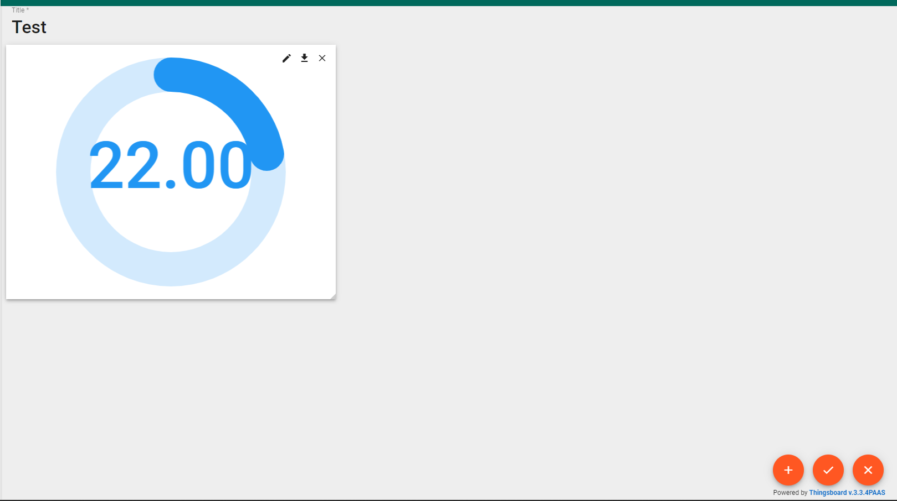

# REMAGrafanaDashboard
## Ubidots & ThingsBoard:

### Librerias Requeridas
Utilice el gestor de paquetes [pip](https://pip.pypa.io/en/stable/) para las librerías necesarias.
1. Geocoder - Librería necesaria para ambas plataformas \
```pip install geocoder``` \
```pip install geopy```
1. Request - Librería necesaria para el script de Ubidots\
```pip install request```
1. Paho MQTT - Librería necesaria para el script de ThingsBoard\
```pip install paho-mqtt```

### ThingsBoard

#### Pasos para crear un dispositivo
1. Ir al siguiente link ```https://thingsboard.cloud/``` y crear una cuenta en caso de no tener. 
1. Se debe crear un dispositivo con un nombre en especifico y señalar el perfil que se le desea dar, para este caso se dejara el defecto, ya que este cuenta con las variables necesarias para cargar la información


2. Obtener el token del dispositivo creado, para añádirlo al script ```datos_aleatorios_Thingsboard.py``` y poder realizar la carga de los datos.


3. Agregar el token en la línea 10 ```ACCESS_TOKEN = 'TOKEN_DEVICE'```
### Pasos para correr el servidor

1. Asegurarse de haber instalado correctamente cada una de las líbrerias requeridas.
1. Correr los archivos .py utilizando el comando, donde ```nameFile.py``` es el nombre de cada uno de los archivos correspondiente a la plataforma que se desee utilizar para cargar los datos. \
```python nameFile.py```
1. La información aparece en la ventana del dispositivo en la opción de ```Latest telemetry```


#### Pasos para crear un widget

1. Se debe crear un nuevo Dashboard en las opciones de ThingsBoard con el nombre que se desee.

1. Para añadir un nuevo widget, es necesario darle a la opción que aparece en la parte inferior con el icono de un lapiz.
1. Añadir un nuevo widget de acuerdo a la representación que se desee utilizar para visualizar la información dentro del catalogo que ofrece la herramienta.

1. En las opciones del widget seleccionar el tipo origen de la información que se desea cargar, siendo este caso desde los dispositivos creados anteriormente tal como lo muestra la imagen. Seleccionar la/s variables que se desea mostrar dependiendo el tipo de visualización a utilizar.


1. Finalmente deberá confirmar los cambios realizados utilizando el boton que se encuentra en la parte inferior izquierda.


### Ubidots

### Pasos para crear un dispostivio

1. Ir al siguiente link ```https://industrial.ubidots.com/accounts/signin/``` y crear una cuenta en caso de no tener. 
1. Crear un dispostivo, para este caso se selecciona el tipo vacio para y se le agrega el nombre especifico. 
1. Obtener el nombre del label ingresado y el token del dispositivo para añadirlo al script para el envío de datos.

1. Modificar el nombre del dispositivo y el token en el script ```datos_aleatorios_Ubidots.py``` en las lineas 7 y 8. \
```TOKEN = 'TOKEN_DEVICE'``` \
```DEVICE_LABEL = 'LABEL_DEVICE'```

### Pasos para correr el servidor

1. Asegurarse de haber instalado correctamente cada una de las líbrerias requeridas.
1. Correr los archivos .py utilizando el comando, donde ```nameFile.py``` es el nombre de cada uno de los archivos correspondiente a la plataforma que se desee utilizar para cargar los datos. \
```python nameFile.py```
1. La información aparece en la ventana del dispositivo en cada una de las variables


#### Pasos para crear un widget

1. Se debe crear un nuevo Dashboard en las opciones de Ubidots con el nombre que se desee.

1. Añadir un nuevo widget de acuerdo a la representación que se desee utilizar para visualizar la información dentro del catalogo que ofrece la herramienta.

1. Configurar el origen de la información, por medio del dispositivo y la variable que se desea mostrar

1. Finalmente deberá confirmar los cambios y podrá visualizar el widget con los datos seleccionados.


## Grafana:

## Instalación
Primero se debe instalar desde la página oficial de Grafana la versión local de este: https://grafana.com/docs/grafana/latest/setup-grafana/installation/

Posterior a esto se debe tener lista la base de datos a ser usada, en este caso se realizó con PosgreSQL, en el repositorio quedará un Backup realizado con el esqueleto de la base de datos para mayor facilidad a la hora de realizar el proceso, este backup es: DBTemplate

## Configuración
Una vez instalado Grafana y configurada la base de datos, se debe agregar esta base de datos como fuente a Grafana, como se evidencia en las imágenes a continuación


Posterior a esto, se debe importar el tablero de control, este es un archivo JSON llamado IOT-DatosHistoricos, como se muestra en la imagen a continuación


## Uso
Finalmente el tablero se encuentra corriendo de manera correcta, para visualizar información debe cargar antes la base de datos
Hay un script que permite cargar la base de datos y a su vez poder simular el flujo en tiempo real, este script es: realtimeDatabaseScript.py


